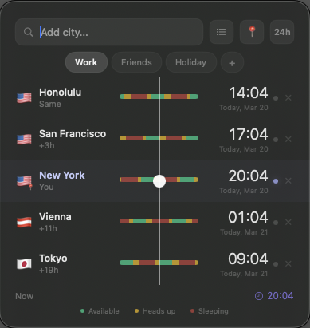
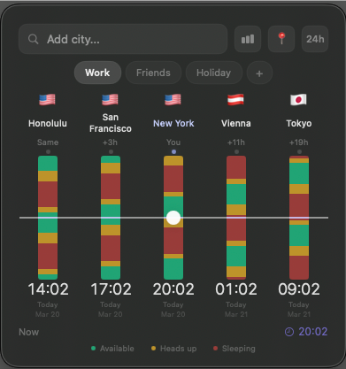

# Whenish

**See the world's time at a glance.** A free, open-source macOS menubar app for tracking time across cities — beautifully.




---

## What is Whenish?

Whenish is a lightweight timezone converter that lives in your macOS menubar. Add your important cities, organize them into groups, and instantly see who's available — without doing timezone math in your head.

**Two ways to view your timezones:**

- **Row View** — Cities listed vertically with color-coded timeline bars. Drag across the bars to scrub through time.
- **Column View** — Cities displayed as vertical columns side by side. Drag a horizontal line up and down to find the perfect overlap window. This makes it immediately obvious when everyone is available at the same time.

## Features

- **Menubar quick view** — See your pinned cities' times right in the macOS menubar, always up to date
- **Timezone groups** — Organize cities into up to 5 groups (Work, Friends, Family, etc.) and switch between them with one click
- **Per-city availability bars** — Green means available, yellow means heads up, red means sleeping — at a glance, for every city
- **Drag to scrub time** — Slide through ±24 hours to find when everyone is awake
- **Home city** — Mark your city with a 📍 so you always know the offset
- **Column view** — A unique layout where overlapping available windows are immediately visible as horizontal green bands
- **500+ cities** — Comprehensive built-in database with geocoder fallback for any city in the world
- **12h / 24h toggle** — One tap to switch time formats
- **Fully offline** — No account, no server, no tracking. Everything runs locally on your Mac

## Install

1. Download the latest release from the [Releases page](../../releases/latest)
2. Open the `.dmg` and drag Whenish to your Applications folder
3. Launch Whenish — it appears in your menubar
4. Click the menubar icon and start adding cities

**Requires macOS 13 (Ventura) or later.**

## Build from Source

```bash
git clone https://github.com/patrik-bernas/whenish.git
cd whenish
open src/TimezoneApp.xcodeproj
```

Build and run in Xcode with ⌘R.

## How It Works

Whenish uses macOS system timezone data (IANA Time Zone Database) so it's always accurate — including Daylight Saving Time transitions. City flags are generated from Unicode regional indicators. No API keys, no external services.

## Contributing

Contributions are welcome! Please open an issue first to discuss what you'd like to change.

## License

MIT License — see [LICENSE](LICENSE) for details.


---

**[whenish.dev](https://whenish.dev)** · Free & open source · Made with care
